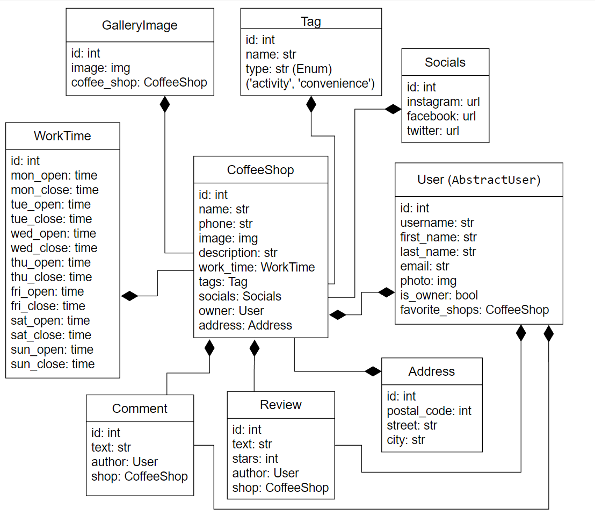

# Coffee shop catalog:

## Instalation

#### Docker
```
git clone https://github.com/haldaniko/coffee-shop-catalogue.git
cd coffee-shop-catalogue

(create .env file like in .env.sample)

docker-compose build
docker-compose up

```

#### Manual

```
git clone https://github.com/haldaniko/coffee-shop-catalogue.git
cd coffee-shop-catalogue

# on macOS
python3 -m venv venv
source venv/bin/activate

# on Windows
python -m venv venv
venv\Scripts\activate

pip install -r requirements.txt

(create .env file like in .env.sample)

python backend\manage.py migrate
python backend\manage.py loaddata train_station_service_db_data.json
python backend\manage.py createsuperuser
python backend\manage.py runserver

```

( will be available at http://127.0.0.1:8000/api/

## Architecture

...

## Structure


## Features

...
